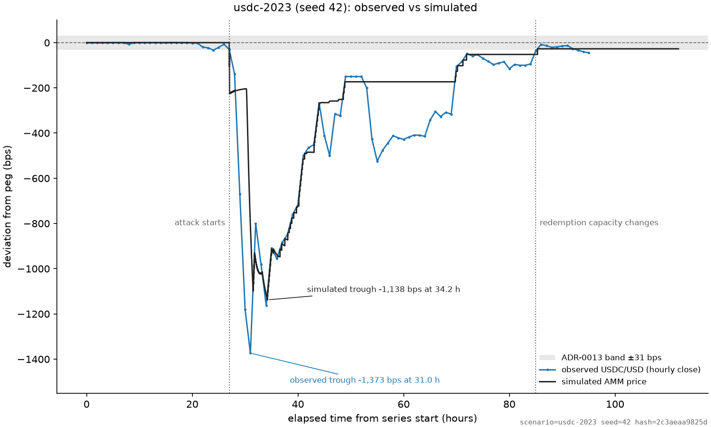
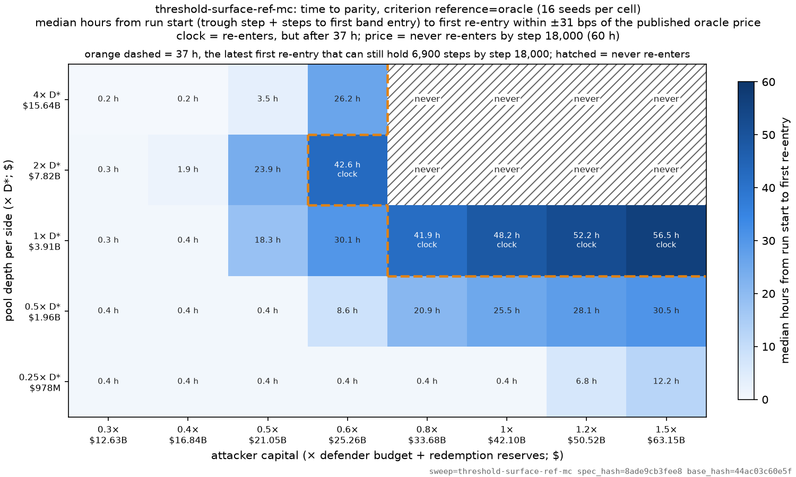

# Corposium Research — Stablecoin Depeg Simulator

A deterministic, agent-based simulator of a stablecoin defending its peg: an attacker
sells into an on-chain pool while the issuer defends with a buying budget and a
redemption channel, and arbitrageurs and believers in the peg trade around them.
Calibrated to USDC's March 2023 depeg, it comes within 235 bps of the observed trough
once one buyer who expects par is added, and it maps the 1992 sterling crisis onto the
same mechanics.
Every figure and number below is regenerated from a named, hashed scenario by one
command, `make figures`.



```bash
make figures   # every figure sweep, then all 15 committed figures: 12 min on 12 cores
```

**Status:** pre-alpha, research note in preparation (target 2026-11-01). MIT licensed.

## Quick start

Python 3.12.

```bash
git clone https://github.com/tjdove/corposium-research.git
cd corposium-research
python3.12 -m venv .venv && source .venv/bin/activate
pip install -e ".[dev]"          # ~70 s on a clean venv without a pip cache
pytest                           # 745 tests, ~15 s
python run.py scenarios/soros-baseline.yaml
```

The last command prints:

```
depeg-sim: scenario=soros-baseline seed=42 hash=2e09f431ce74
run: steps=192 terminated_by=peg_recovered max_depeg_bps=-573.2 reserves_exhausted=False
wrote: output/soros-baseline-42-2e09f431
```

and writes one directory per run, named `<scenario>-<seed>-<hash[:8]>`:

```
output/soros-baseline-42-2e09f431/
  manifest.json          provenance: scenario hash, seed, versions, files, resolved config
  summary.json           headline numbers (max depeg, recovery, reserves, PnL, who redeemed)
  timeseries.parquet     one row per step: prices, reserves, agent balances and PnL
  events.jsonl           every event, one JSON object per line
  decisions.jsonl        every agent decision with its rule (when trace_decisions)
  checkpoints/step-000192.json
  peg_trajectory.png     the chart
```

Options: `--seed N` overrides the scenario seed, `--output DIR` sets the parent
directory (default `output/`), `--no-chart` skips the PNG. Re-running the same scenario
and seed replaces that run's directory. Same seed + same scenario = byte-identical
output (everything except `manifest.json`'s `created_utc`).

## Results so far

Interim results; the reasoning behind each is in [`docs/FINDINGS.md`](docs/FINDINGS.md),
and every figure with its source and caption is in
[`docs/figures/README.md`](docs/figures/README.md).

**Validation: USDC, March 2023** (the figure above). Observed USDC/USD hourly closes
(blue) and the simulated AMM price (black), in bps from par. With one par-expecting
buyer fitted to the replay, the simulated trough is −1,138 bps against −1,373 bps
observed, and from 35 h to 49 h the two paths lie on each other. Without that buyer the
model's trough is four times too deep: the depth of a depeg is set by the attacker
against everyone who believes the promise. See
[the validation finding and its confirmation](docs/FINDINGS.md#f-08--the-replay-fails-validation-the-model-has-no-buyer-of-the-discounted-promise).



**Price or clock.** Median hours from run start until the pool is back within ±31 bps of
the oracle price, over pool depth (rows, × the fitted depth D\*) and attacker capital
(columns). Cells outside the dashed outline re-enter before 37 h, early enough that the
pool can still hold the band for the 23 h the criterion asks by the 60 h horizon. At
calibrated depth (1× D\*) large attacks are lost on the **clock**: the issuer wins the
price back, but after 41.9–56.5 h, too late. At 2× and 4× D\* they are lost on the
**price** (hatched, "never"): no seed gets back within the band. Pools at or below half
of D\* re-enter within 31 h at every attack tested, and at least 12 of 16 seeds recover.
See [the clock finding and its refinement](docs/FINDINGS.md#f-11-refinement-2026-10-04-from-28).

**Spend slower than the attacker sells.** Against an attack equal to the issuer's whole
budget plus reserves, what decides time to parity is the defender's spending pace
relative to the attacker's selling pace; the trigger level does not matter. Against the
slower of two attackers, a defender at a quarter of its pace is back in 2.0 h, at half
in 7.9 h, at equal pace in 47.1 h (past the 37 h deadline), and from 1.5× up never
([`pace_ratio.png`](docs/figures/pace_ratio.png)).

## Scenarios

One YAML file per scenario; every value's source is in the file's header. The hash is
`load_scenario(path).content_hash()[:12]`, printed by `run.py` and pinned by a test.

| File | What it is | Hash |
|---|---|---|
| `scenarios/soros-baseline.yaml` | First end-to-end scenario: flat reference price, placeholder magnitudes; the quick-start run | `2e09f431ce74` |
| `scenarios/soros-volatile.yaml` | `soros-baseline` with a noisy reference price, so the seed matters | `84ad0b810807` |
| `scenarios/calibrated-baseline.yaml` | USDC / SVB, March 2023, at calm volatility and fitted pool depth D\*, with a par-expecting holder; the base of most sweeps | `44ac03c60e5f` |
| `scenarios/calibrated-stress.yaml` | `calibrated-baseline` at the stress-window volatility (24.5× calm) | `17b24b458e47` |
| `scenarios/usdc-2023.yaml` | Replay of the observed USDC/USD series, 10–13 March 2023: the validation run | `2c3aeaa9825d` |
| `scenarios/soros-1992.yaml` | Black Wednesday, 16 September 1992, as ratios of capital, budget, reserves and depth | `f4e26ae66440` |
| `scenarios/soros-1992-no-defense.yaml` | The 1992 counterfactual: no market buying, no rate rise, only the reserve | `516edaef4795` |
| `scenarios/policies/early-aggressive.yaml` | Calibrated baseline; defender enters at −0.5% and spends half its remaining budget per step | `2ea789dddc6c` |
| `scenarios/policies/late-conservative.yaml` | Calibrated baseline; defender waits for −2% and spends a tenth per step | `e9c44d939fb2` |
| `scenarios/policies/no-defense.yaml` | Calibrated baseline with no defender | `36c6cd80fc72` |
| `scenarios/policies/spread-only.yaml` | Calibrated baseline; at −1% the defender widens the redemption spread by 200 bps and never buys | `ba8301d92026` |

## Sweeps

A sweep runs a scenario over a grid of parameter values and seeds:
`python -m depeg_sim.sweep sweeps/<file>.yaml --mc --workers 12` writes
`output/<name>/` (one row per run, one aggregated row per grid point; about 2 GB of
run directories per 200 runs). Wall times on Seoul (12 cores, 12 workers); the starred
sweeps feed the committed figures and run in `make figures`. The last two run without
`--mc` (one seed each).

| File | What it asks | Runs | Wall time |
|---|---|---:|---:|
| `sweeps/threshold-surface-ref-mc.yaml` ★ | Time to parity and p(stays broken) over pool depth × attacker capital, recovery measured against the oracle price | 640 | 138 s |
| `sweeps/threshold-surface-mc.yaml` ★ | The same surface with recovery measured against par | 640 | 136 s |
| `sweeps/budget-x-depth-mc.yaml` ★ | Defender budget needed to hold the price, over pool depth | 200 | 52 s |
| `sweeps/budget-x-attack-mc.yaml` ★ | Defender budget needed, over attack size, at twice the fitted depth | 200 | 57 s |
| `sweeps/oracle-lag-mc.yaml` ★ | Oracle heartbeat × deviation threshold under stress volatility | 640 | 110 s |
| `sweeps/policy-comparison-mc.yaml` ★ | Five defender policies (`scenarios/policies/` + baseline) × attack size | 240 | 74 s |
| `sweeps/pace-x-trigger-mc.yaml` ★ | Defender spending pace × defense trigger × attacker pace | 256 | 92 s |
| `sweeps/pace-ratio-mc.yaml` ★ | Defender pace relative to attacker pace, two attacker paces | 112 | 23 s |
| `sweeps/holder-exit-1992-mc.yaml` ★ | 1992 analogue: the discount at which the believer sells on the venue (or never) × believer capital | 120 | 19 s |
| `sweeps/capital-vs-resources-mc.yaml` | Early test: does attacker capital vs budget + reserves decide the outcome (uncalibrated) | 2,016 | 11 s |
| `sweeps/pool-depth-x-attacker-mc.yaml` | Early test: pool depth × attacker capital on the noisy baseline (uncalibrated) | 512 | 3 s |
| `sweeps/pool-depth-x-attacker.yaml` | The first threshold-surface grid, one seed (uncalibrated) | 16 | 1 s |
| `sweeps/usdc-2023-pace.yaml` | Fit of the replay attacker's selling pace to the timing of the observed trough | 7 | 4 s |

## Make targets

`PYTHON` defaults to `.venv/bin/python` when the repo has a `.venv`, so no activation
is needed; otherwise it is `python`. Override with `make test PYTHON=...`. `WORKERS`
defaults to the number of cores.

| Target | What it does |
|---|---|
| `make test` | `pytest`, failing if line coverage of `protocol/` and `agents/` drops below 85% |
| `make lint` | `ruff check .` and `ruff format --check .` |
| `make figures` | Runs every figure sweep in full, redraws every committed figure, writes `docs/figures/manifest.json` |
| `make figures-check` | The stale-figure guard (CI runs it): fails if a figure's scenario or sweep changed since it was drawn; warns if the package code did |
| `make figures-quick` | Smoke test: every figure sweep at 2 seeds into a temp directory; writes nothing under `docs/` |

## Figures

All committed figures, with source, caption and the finding each supports:
[`docs/figures/README.md`](docs/figures/README.md).

## Further reading

- [`docs/FINDINGS.md`](docs/FINDINGS.md) — what the model has shown, in the order it was learned
- [`docs/BACKGROUND.md`](docs/BACKGROUND.md) — the 1992 ERM crisis and how it maps to the simulator
- [`docs/LITERATURE.md`](docs/LITERATURE.md) — outside sources and events, with verification status
- [`docs/REPRODUCIBILITY.md`](docs/REPRODUCIBILITY.md) — versions, commands, timings and hashes for reproducing every figure
- [`docs/adr/`](docs/adr/README.md) — architecture and research decision records
- [`docs/PROCESS.md`](docs/PROCESS.md) and [`CONTRIBUTING.md`](CONTRIBUTING.md) — how the project is built and how to add to it
- [`docs/CHARTER.md`](docs/CHARTER.md) — mission, scope and timeline

## Layout

```
src/depeg_sim/
  kernel/       engine, clock, scheduler, run context, checkpoints
  protocol/     AMM, oracle, redemption modules
  agents/       attacker, arbitrageur, defender, holder
  environment/  external price process, shocks
  experiments/  single-run runner, output writer, sweeps and Monte Carlo aggregation
  analysis/     summary, metrics, charts
scenarios/      versioned YAML scenario definitions
sweeps/         sweep specs (grids over scenario parameters)
scripts/        fitting probes, tables, make_figures.py, check_figures.py
data/           observed price series used by the replay
tests/          pytest
docs/           figures, findings, decisions, calibration sources, process
output/         run artifacts (gitignored)
```

## License

MIT. See [`LICENSE`](LICENSE).
