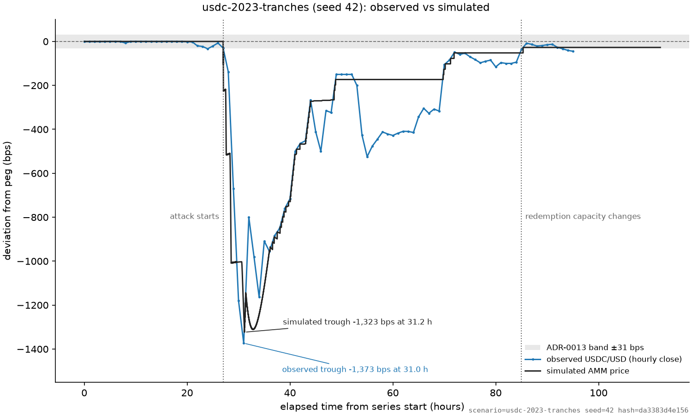
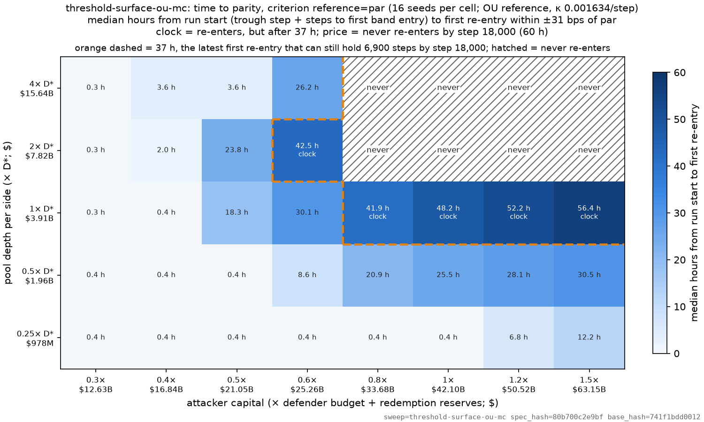
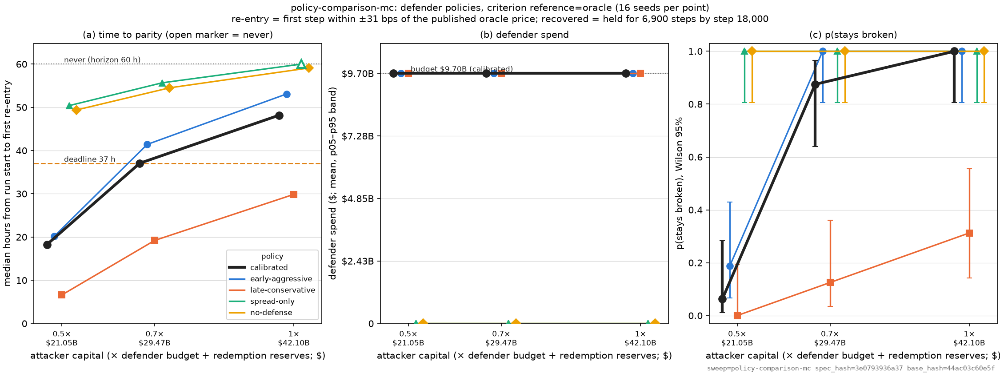
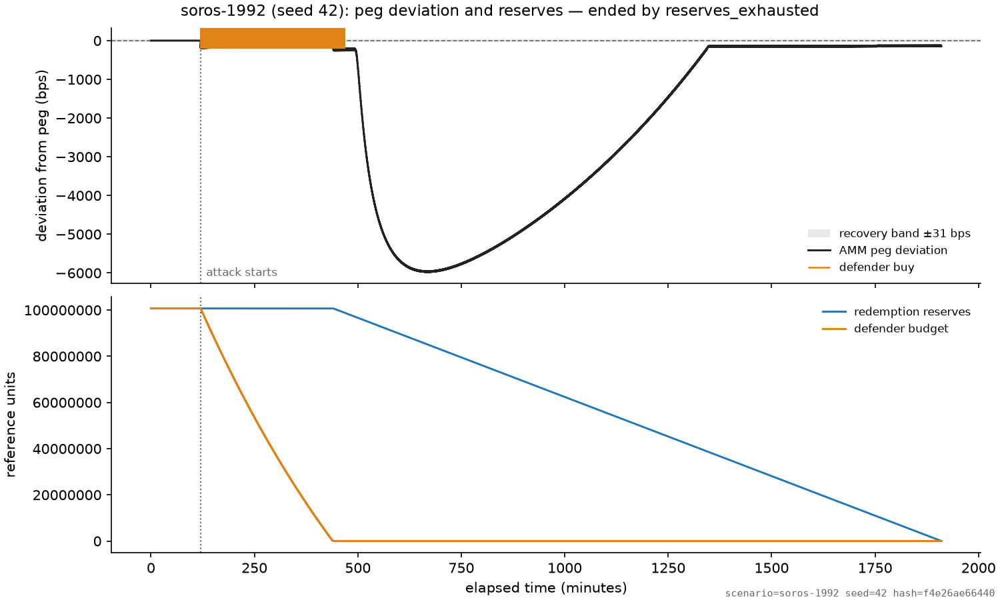

# What breaks a peg: a 1992 currency attack, replayed on-chain

**Corposium Research · draft v1.0 · 2026-10-09 · code frozen at `v0.9-freeze`**

*A deterministic simulator of a stablecoin under speculative attack, calibrated to Curve,
Chainlink and Circle, validated against USDC's March 2023 depeg, and run against the 1992
sterling crisis it was modelled on. Everything here regenerates from one command.*

---

## Abstract

We built an agent-based simulator of a stablecoin defending its peg — an attacker sells
into an on-chain pool; an issuer defends with a buying budget and a redemption channel;
arbitrageurs and believers in the peg trade around them — and calibrated it to public
parameters for USDC in March 2023. The replay of that weekend failed at first: the model
fell four times too far. It came within 17% of the observed trough once a buyer who
expects redemption at par was added, and within 4% and nine minutes once those buyers
were spread across a ladder of entry prices. The depth of a depeg is set by the attacker
against everyone who believes the promise.

Beyond that, the model says four things the 1992 analogy does not. Deep liquidity protects
the price and makes the defense unaffordable. A defender that spends faster than the
attacker sells is defending the attacker's exit price. At issuer scale the binding
constraint is not reserves but the clock. And a believer who loses faith on-chain has two
exits — the venue or the issuer — and only one of them breaks the peg. The code, every
parameter's source, and every figure's regenerating command are public.

---

## 1. The question

A peg is a price promise. On 16 September 1992 the Bank of England spent its reserves and
raised rates twice in a day to keep sterling inside its ERM band, and lost. The standard
account is that the promise exceeded the resources behind it once speculators attacked and
the market's belief in it broke. That account has a theory behind it — reserve-exhaustion
models, self-fulfilling-crisis models, global games — and a question we can ask of any
pegged asset: under what combination of liquidity, attacker capital, defense resources and
defense policy does the promise fail?

Stablecoins are pegs. They have an issuer with reserves, a redemption promise, venues where
the price is set, and attackers with capital. They also have things 1992 did not: public
reserves, an automated market maker whose price impact is exact, an oracle, and a
redemption channel with a throughput limit. We built the smallest model that contains all
of these, calibrated it to one real event, and asked the 1992 question of it.

The analogy is a tool, not a thesis. Where the on-chain mechanics turn out to work
differently from 1992, that is a result, and §7 collects them.

## 2. The model in one page

The simulator is a deterministic, discrete-step agent-based model. One seed and one
scenario file produce byte-identical output; nine ordered phases per step, versioned.

**Venue.** A constant-product pool of stablecoin against a reference asset, with a fee on
input. Its spot price is the stablecoin's price.

**Oracle.** Publishes the reference price when it moves by a deviation threshold or when a
heartbeat elapses, as Chainlink does.

**Redemption.** The issuer pays par, less a spread, from reserves, through a queue with a
per-step capacity. Reserves are only reached through redemption.

**Agents.** An *attacker* sells a fixed stock of stablecoin at a pace. A *defender* — the
issuer — buys on the venue below a trigger, at a pace, from a budget, and may widen the
redemption spread. An *arbitrageur* buys on the venue when the price is below the oracle by
more than fees and redeems. A *holder* — the believer — buys below an entry discount because
it expects par, redeems whenever the queue is clear, and (optionally) sells everything once
the price passes an exit discount. A *liquidity provider* withdraws its share of the pool
below a panic threshold and holds what it took out.

**Recovery.** The peg has recovered when the venue price has stayed within ±31 bps of par
for 6,900 steps (23 h at 12 s per step), judged inside a 60 h horizon. The calm reference
price reverts to par with a half-life of 1.4 h, fitted from the calm USDC series.
*Time to parity* — hours until the price first re-enters the band — is the metric most
figures use, and it does not depend on how the reference is modelled.

Every real-world actor in the 1992 story has a counterpart here, mapped by what it touches
(price, reserves, budget) rather than by its name. One of those mappings was wrong until
late in the build, and it became a result (§7).

## 3. Calibration and validation

**Every parameter has a source.** Pool depth is anchored to the Curve 3pool's USDC leg; the
oracle to Chainlink's USDC/USD feed (0.25% deviation, 82,800 s heartbeat); reserves and
budget to Circle's disclosed 77/23 split of T-bills and cash; the redemption channel to the
weekend's observed capacity. The attacker is sized to the episode's net USDC burn, $2.71B.
Three numbers are fitted, each to one observation by a stated rule: the aggregate pool
depth D\*, the believers' capital C\*, and the attacker's pace.

**The replay failed first.** Fed the observed USDC/USD series as its reference and run
without an issuer buying on venues (Circle did not), the model's trough was −5,769 bps
against −1,373 observed — four times too deep — though the timing was right to the half
hour. The model had no agent who bought USDC at $0.88 on Saturday because they expected
Circle to pay $1.00 on Monday. On the calibrated baseline that role had been hidden: the
issuer's own buying absorbed 89% of the attack there, standing in for a market that in
the real event was the buyer.

**One buyer, one price.** With a single believer who buys below a 2% discount and redeems
when it can, sized by back-solving the replay with everything else held, the trough is
−1,138 bps: within 17%. The buyer's capital, $2.15B, is 0.79× the attack. From 35 h to
49 h the simulated path lies on the observed one. The trough is 3.2 h late, which we
report rather than re-fit.

*Figure 1. Observed hourly closes (blue) and the simulated venue price (black), in bps from
par. One fitted parameter: the believer's capital.*

**Many buyers, a ladder of prices.** Real buyers did not all enter at one discount. With
the believers' capital spread equally across entry discounts of 2, 5, 10 and 20% — one
of three fixed ladders we tried, the assumption stated as one — and the total again fitted
by the same rule ($2.54B, 0.94× the attack), the trough is −1,323 bps at 31.2 h against
−1,373 at 31.0 h: within 4%, and within nine minutes, with the timing improving without
pace being touched. The deeper tranches absorb later, so the trough arrives when the
attacker's selling ends rather than when a single buyer runs dry.

*Figure 1b. One fitted parameter plus one stated assumption. The descent is a staircase:
the price pauses at each tranche's entry while that tranche still has money.*

**What validation claims and does not.** One event; one venue standing in for all venues;
an hourly series that cannot resolve the first hour's shape. With a single entry price the
fit cannot land on the observation: depth is bimodal in the believers' capital, attacker-set
below a cliff and buyer-set above it, and −1,373 sits on the cliff face. A ladder turns
the cliff into a staircase, not a curve, and no public data pins its spacing. We show both
figures so a reader sees what one parameter buys and what an assumption adds.

## 4. Depth, resources and the clock

The first-generation theory says a peg breaks when the attack exceeds the reserves. The
model agrees, with two corrections about what "reserves" and "exceeds" mean on-chain.

**Outcome is capital against resources; depth sets the price.** Across pool depths from a
quarter of D\* to four times it, whether reserves run out is decided by the attacker's
capital against the defender's budget plus what the redemption channel can pay — not by
pool depth. Depth decides how far the price falls on the way.

**But depth enters through the price the defender pays.** A shallow pool crashes harder, so
each unit of budget buys more stablecoin; a deep pool holds the price near par, so the
same budget absorbs less. In a pool at or below D\*, a dump worth the whole budget crashes
the price to a fraction of a cent and the budget buys all of it back. At twice D\* the
attacker is paid more per unit and the same budget cannot; holding the price there needs a
budget of about a third of the attack, rising in proportion to it. **Deep liquidity
protects the price and makes the defense unaffordable.**

**At issuer scale the reserves cannot run out; the clock can.** USDC's redemption channel
on that weekend could pay about 10.9M of 138.1M reserve-units in 60 h. Reserves are never
exhausted inside the horizon at any attack size we ran. What fails is time: the price
comes back, but too late to hold the band before the horizon ends.

*Figure 2. Median hours until the venue price is back within 31 bps of par, over pool depth
(rows, × D\*) and attacker capital (columns, × the defender's budget plus reserves). Cells
inside the dashed outline re-enter after 37 h — too late to hold the band by 60 h — and are
lost on the clock. Hatched cells never re-enter and are lost on the price.*

Read Figure 2 by row. At a quarter and a half of D\*, the price is back within minutes to
half an hour at every attack size. At D\*, attacks of 0.8× resources and up are won on the
price and lost on the clock: median re-entry at 42–56 h. At twice D\* and above, the same
attacks are lost on the price outright. The clock at D\* is the redemption channel's
throughput, and nothing else: it is the same to the decimal whether the reference wanders
or reverts, and whether recovery is judged against par or against the oracle.

One qualification, from the last thing we built (§7): the clock result assumes the pool
keeps the attacker's stablecoin. If liquidity leaves, it does not.

## 5. Which defense survives

Charter question five was which defense policy survives a matched attack. We compared an
issuer that buys early and fast (trigger 0.5%, 50% of remaining budget per step), the
calibrated one (1%, 20%), one that buys late and slowly (2%, 10%), one that only widens the
redemption spread, and no defense at all, at three attack sizes.

*Figure 3. Left: time to parity. Middle: average price paid per stablecoin by the three
buying policies. Right: probability the peg stays broken. Every buying policy spends its
entire budget at every attack size.*

Every buying defender spends its whole budget. What differs is what the budget bought.
The fast defender is dry within twelve steps, before the attacker has finished selling,
having bought near par; the attacker's remaining stock then sets a new low that nothing
defends. The slow defender still has budget when the selling stops and buys the bottom —
0.283 per stablecoin against 0.358 — and at a full-size attack it is the only policy that
recovers at all (29.9 h against 48–59 h, 11 of 16 seeds against none). It is not cheaper
because someone else paid: the believers absorb less under it.

The trigger does nothing. The attacker's first sale puts the price near $0.23, which
crosses every trigger up to 4% on the first step. What decides the outcome is the
defender's spending pace relative to the attacker's selling pace: at half the attacker's
pace the defender is back in hours; at equal pace, back late; at one and a half times the
attacker's pace or more, never. A slower attacker is harder to beat at every ratio.
**Spend slower than the attacker sells.** In September 1992 the Bank of England spent fast,
at the floor, while the selling was still coming; the model says that is the policy most
likely to lose.

The spread-only defense never recovers — but not because of a dead zone. Capacity-limited
redemption keeps paying out through the band and the 200 bps spread costs about an hour;
spread-only fails on the clock, like no defense.

## 6. Oracle lag

Chart (3) of the plan was oracle-lag sensitivity. It is a flat line. Across heartbeats
from one minute to 23 hours and deviation thresholds from zero to 1%, the trough moves by
less than 11 bps; Chainlink's actual settings (0.25%, 82,800 s) are within 0.5 bps of a
zero-lag oracle. Under stress volatility the reference moves a quarter percent within a
few steps, so a deviation-triggered oracle updates almost continuously and the heartbeat
never binds. Oracle lag is not a depeg risk factor at Chainlink's settings
([figure](figures/oracle_sensitivity.png)).

## 7. The 1992 analogue, and where it breaks

We ran the model as 1992: the Bank's reserves and defense budget as the war chest, the two
rate rises as a redemption spread of 200 bps, Quantum's position as the attacker's unit,
and the question "at what multiple of Quantum does the Bank run dry?"

*Figure 5. The analogue at 6× Quantum: reserves exhaust at step 9,553 (32 h). The
no-defense counterfactual is in the repository.*

With no believers, the analogue breaks at 5.7× Quantum. With a believer the size of the
USDC one, 5.2×. With believers at 0.9× the attacker, **4.9×** — a ratio of attack to
resources of 1.04, within 4% of the first-generation formula. The model's Black Wednesday
needs the convergence traders.

But it needs them in a particular way, and finding out which way corrected our mapping.
The 1992 account says the peg broke when the convergence traders "switched sides." We first
modelled that as the believer selling everything on the venue once the price fell past an
exit discount. That version makes the peg *harder* to break (the flip moves back to 5.7×)
and costs the believer 36–77% of its capital. Selling on the venue moves the price; it
never touches the reserves. Reserves are reached only through redemption. In 1992 a holder
of sterling who lost faith had one way out: sell to the Bank at the floor — which is, in
the model's terms, a redemption. The believer who breaks the Bank is the one who keeps
the faith and redeems, calmly, at par, until the reserves are gone.

**On-chain, a believer who loses faith has two exits: the venue or the issuer. Selling on
the venue breaks the price and spares the reserves; redeeming spares the price and drains
the reserves. Only the second breaks the peg.**

Two more places the analogy breaks, both results rather than caveats:

- *Liquidity flight helps the defender.* The charter called liquidity leaving when it is
  needed "the core Soros dynamic." In the model, liquidity providers who flee a depeg and
  sit on what they withdrew take the attacker's stablecoin out of the venue with them: a
  half-flighty pool turns a full-size attack from "never holds par" into recovery in
  22 h, and deepens the trough by under 1%, because a provider reacting to a price is one
  step behind the sale that set it. The condition is the whole result — a provider who
  dumped or redeemed what it withdrew would be a second attacker or a second redeemer —
  and it is the first thing the next version of this model will test.
- *A believer who overpays is an accidental defender.* Before its fills were capped at its
  entry price, the model's believer held the venue above the redemption payout, the
  arbitrageur stopped redeeming, and the Bank survived to the horizon — at the believer's
  expense. A disciplined believer is a redeemer in waiting.

And the list we started with (BACKGROUND, "Where the analogy breaks"), each now tied to
where the model showed it: the defense lever (a spread is not a rate rise, and here it
buys an hour); no political cost function (our defender follows rules); transparency; no
partner central bank; the promise itself; market structure and time; and the two exits.

Three thresholds in the model — the defender's trigger, the believer's exit, the
provider's panic — turned out to be inert, because a first sale that crosses all of them
makes *when* irrelevant. Only how much, and how fast, matter.

## 8. Limitations and next questions

One validation event. One venue standing in for an aggregate of venues. A single entry
price gives a cliff and a ladder gives a staircase; no public data says where the
believers' money sat. The liquidity provider holds what it withdraws. The defender has no
cost function and never gives up. Stress-volatility surfaces were run under the random-walk
reference, calm ones under the reverting one.

Next: a provider that dumps or redeems what it withdrew; several providers with different
thresholds; a second validation event (Terra's UST, May 2022, or Ethena's USDe single-venue
print of September 2026, which is the one case where the oracle module itself would be
under test); a multi-venue structure; a defender that weighs the cost of defending against
the cost of quitting.

Two recent benchmarks frame why a mechanistic, replicable model is worth publishing: a
game-theoretic treatment of stablecoin attacks (Gupta & Gupta 2025) names the critical
attack fraction this model computes, and StableEval Arena (Wan, Liu & Zhang 2026) reports
that LLM-backed peg-risk agents "still miss most rare severe-stress and sustained-depeg
cases." Sustained depeg is exactly what Figure 2 is a map of.

## 9. Reproducibility

`git clone`, `pip install -e .`, `make figures`. Every figure's source scenario or sweep
and its hash are in a manifest; a guard in CI fails if a source changes and warns if the
code does; the three fitted numbers are written with their inputs and script hashes.
Nineteen figures regenerate in about fifteen minutes on twelve cores. Code is frozen at
`v0.9-freeze`.

---

## Figure list (committed, `docs/figures/`)

One row per figure; must match `docs/figures/README.md` one-to-one, "record only" rows
with its Record only section (`tests/test_note_figures.py`). Rows marked † were added at
the Story 4.1 figure pass so the list matches the README's note set (every committed
figure not moved to the record); the dev manager may move any of them to the record.

| # | file | section | finding(s) | status |
|---|---|---|---|---|
| 1 | `validation_overlay_usdc_2023.png` | 3 | F-08 (+confirmation), F-09 | final |
| 1b | `validation_overlay_usdc_2023_tranches.png` | 3 | F-09 refinement | final |
| — | `peg_trajectory_calibrated.png` † | 4 | F-06, F-03 | final |
| 2 | `time_to_parity_ou.png` | 4 | F-03, F-06, F-11, F-04 resolution | final |
| — | `threshold_surface_ou.png` † | 4 (supporting) | F-11, F-04 resolution | final |
| — | `budget_depth.png` | 4 (supporting) | F-11 refinement | final; may drop for length |
| — | `budget_attack.png` | 4 (supporting) | F-11 second refinement | final (3.4) |
| — | `lp_flight.png` † | 4 | F-15, F-03, F-11 | final |
| 3 | `policy_comparison.png` | 5 | F-13, F-07 refinement | final (panel (b) = price paid, 4.1) |
| — | `pace_trigger.png` | 5 (supporting) | F-13 refinement | final (3.4) |
| — | `pace_ratio.png` | 5 (supporting) | F-13 refinement | final (3.4) |
| — | `peg_trajectory_baseline.png` † | 5 | F-01 | final |
| 4 | `oracle_sensitivity.png` | 6 | F-10 | final |
| 5 | `peg_trajectory_1992.png` | 7 | F-07, F-12, F-14 | final |
| 5b | `peg_trajectory_1992_no_defense.png` | 7 | counterfactual | final |
| — | `threshold_surface_par.png` | record only | F-11 | not in the note |
| — | `threshold_surface.png` | record only | F-11, F-03 | not in the note (random-walk, oracle criterion) |
| — | `time_to_parity.png` | record only | F-11 | not in the note (random-walk) |
| — | `holder_exit.png` | record only | F-14 | not in the note |

## Open decisions for Tim

1. Lead with the validation (headline 1) or with the mechanism (headline 2)? Outline
   assumes validation first: it is the thing a reader can check.
2. How much 1992 narrative in §7 — the note's own retelling, or a pointer to BACKGROUND
   published alongside?
3. Named author(s) and the Corposium Research framing in the first paragraph.
4. Hero image for the README and the site page: the single-entry overlay (one parameter,
   17%) or the ladder overlay (one parameter + an assumed ladder, 4%, timing to nine
   minutes)? The note shows both in §3 either way.

## Change Log

- 2026-10-06: Outline drafted by dev manager from FINDINGS F-01…F-14 during Epic 3 (Story 3.4 in build).
- 2026-10-09: v1.0 draft written against the frozen figures (`v0.9-freeze`); Story 4.2.
- 2026-10-08: Figure list only, Story 4.1 (builder): one row per committed figure, matching `docs/figures/README.md`; `threshold_surface.png` and `time_to_parity.png` moved to record only; rows marked † added. Outline text not edited.
